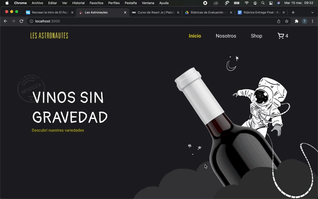
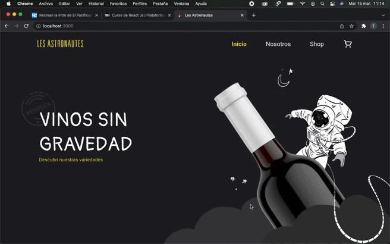

# Bienvenidos a Les Astronautes!

El proyecto presente responde al trabajo de cursada sobre la librería React JS brindado por CoderHouse.
Tras un viaje a la provincia de Mendoza, decidí hacer una tienda dedicada a la venta de vinos, y sus diferentes blends. 
Para la misma, se tomó inspiración de una bodega del mismo nombre ya que la estética de la marca me pareció sumamente original.

Todos los derechos sobre el nombre/marca/branding/etc "Les Astronautes" corresponde a:
https://www.instagram.com/astronauteswines/?hl=es
https://linktr.ee/Astronauteswines

Sobre los productos mostrados, los mismos fueron tomados prestados de diversas tiendas de bodegas. Derechos reservados a quien corresponda.

## Muestras del proyecto

